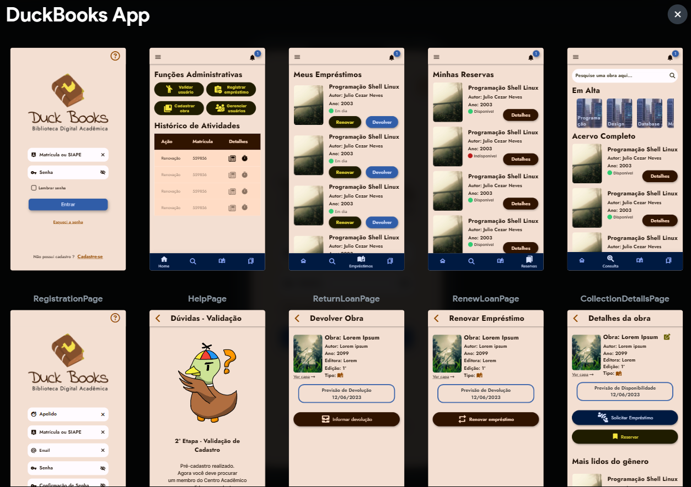

# README


<div align="center" name="inicio">
  <a href="https://github.com/duckbookssmd/duckbooksapp"></a>
</div>


### Sumário: [Sobre](#sobre) • [Equipe](#equipe) • [Licença](#licença) • [Tecnologias](#tecnologias) • [Configurações do ambiente](#configurações-do-ambiente) • [Requisitos funcionais](#requisitos-funcionais) 

<!-- [Relatório Técnico](#relatório-técnico) • -->

# Sobre

**A mobile digital application in Flutter/Dart, extension to the library services of the Academic Center of the Bachelor Course in Systems and Digital Media of the Federal University of Ceará - Campus Pici**

> A aplicação mobile presente nesse projeto foi desenvolvida no 3° semestre do Curso de Sistemas e Mídias Digitais, Universidade Federal do Ceará(Campos do Pici) como uma solução para facilitar e deixar mais dinâmico os serviços oriundos do gerenciamento do acervo de obras da biblioteca presente na sala do Centro Acadêmico do curso.  O produto final tem como intuito oferecer uma alternativa simples, segura e eficiente para ações cotidianas para os Membro do C.A. em cargo da biblioteca do Bloco do SMD como realizar a pesquisa de uma obra específica ou realizar um empréstimo.



_Amostra das telas idealizadas através do protótipo de alta (Feita com Flutterflow)_

# Equipe

| NOME | CARGO |
| --- | --- |
| André Lucas de Oliveira Domingues | Programador Chefe e Design UX |
| Douglas Levi da Silva Gomes | Designer UI/UX |
| Erik Elvis Barros de Oliveira | Programador |
| Francisco Guilherme Aguiar Ribeiro | Designer UI |
| Wesley Barbosa Martins Ribeiro | Líder e Design UI/UX |

## Agradecimentos especiais:

- Guilherme Maciel Miranda, O grande ganso dos Duck Books, Nosso Pato Tester/Ilustradir/UX pesquisador


# Tecnologias

## Prototipação

Para o planejamento da interface da aplicação utilizamos: 
 -  [Figma](https://www.figma.com/);
  -  [Flutterflow](https://flutterflow.io/);

## Frontend

Utilizamos o Framework  [Flutter](https://flutter.dev/) para construir nossa aplicação.

## Backend

Para a amazenação e gerenciamento dos dados de forma simples utilizamos o 
            
          [Firebase](https://firebase.google.com/)

# Organização

### As pastas principais se encontram no diretório ```/lib``` e são organizadas da seguinte forma:

- ### ```main.dart```

  - Arquivo principal da aplicação chamado ao executar o programa

- ### ```assets```

  - Pasta destinada a imagens, fontes e temas utilizadas

- ### ```configs```

  - Pasta destinada a configurações locais da aplicação no dispositivo

- ### ```models```

  - Pasta destinada aos modelos de entidades para o banco de dados

- ### ```pages```

    - Pasta destinada a construção das telas da aplicação

- ### ```services```

    - Pasta destinada a serviços usados na aplicação (firebase)

- ### ```widgets```

    - Pasta destinada a widgets personalizados

---

# Configurações do ambiente

## Requisitos da máquina:

- Java (java)
    - para checar existência use ```java -version```
    - para instalar em Windows basta baixar o executável (versão 8 ou mais recente) no site da Oracle
    - para instalar em Linux basta digitar o comando ```sudo apt install default-jre```
- Java Compiler (javac)
    - para checar existência use ```javac -version```
    - para instalar em Windows basta baixar o executável (versão 8 ou mais recente) no site da Oracle
    - para instalar em Linux basta digitar o comando ```sudo apt install default-jdk```

## Ambiente de Desenvolvimento

- Baixar o sdk do Flutter version 3.10.1 ou superior on channel stable
- Instalar e configurar o Android Studio
    - Android SDK version 33.0.0)
    - Platform android-33, build-tools 33.0.0
    - Java version OpenJDK Runtime Environment (build 11.0.15+0-b2043.56-9505619)
- Instalar os Plugins de Dart e Flutter no Android Studio
- Acessar a aba SDK Manager e baixar Android SDK Command-line Tools
- Instalar e configurar o VS Code (version 1.78.2)
- Instalar os Plugins de Dart e Flutter no VS Code

Alguns links que podem ajudar:

- Para Windows
    - https://www.youtube.com/embed/FUWYvBJOlsI
- Para Linux
    - https://www.youtube.com/embed/QUqeicMtkkk
    - https://www.youtube.com/embed/nmpv9arA7Ik

# Como rodar 

### Clonar repositório

```bash
git clone https://github.com/duckbookssmd/duckbooksapp.git
cd duckbooksapp
cd app
flutter pub get
```

### Gerar APK da aplicação 

```bash
cd app
flutter build apk # O .apk dá aplicação será buildado para a pasta \duckbooksapp\app\build\app\outputs\flutter-apk
```

##  Requisitos funcionais

| Código | Descrição | Status |
| --- | --- | --- |
| RF G001 | Cadastrar usuário no sistema / Cadastrar (1/2) | ✓ |
| RF PA002 | Cadastrar Obra do acervo | ✓ |
| RF PA003 | Editar dados de obra presente no acervo | ✓ |
| RF G004 | Pesquisar obras cadastradas | ✓ |
| RF G005 | Exibir informações sobre uma obra | ✓ |
| RF PA006 | Registrar empréstimos | ✓ |
| RF G007 | Alterar tema da aplicação de acordo com o tema do dispositivo | ✓ |
| RF G008 | Realizar Login | ✓ |
| RF PA009 | Cadastrar usuário no sistema / Validar (2/2) | ✓ |
| RF G010 | Exibir tela de ajuda | ✓ |
| RF G011 | Exibir tela de orientações para finalização do cadastro | ✓ |
| RF G012 | Realizar Logout na tela de início do usuário | ✓ |
| RF G013 | Manter Login salvo | ✓ |
| RF PF014 | Exibir Carrossel de categorias | ✓ |
| RF PF015 | Exibir Tela de obras em posse | ✓ |
| RF PF016 | Exibir Tela de obras reservadas | ✓ |
| RF PA017 | Mostrar a seção de exibição das atividades realizadas pelo membro do C.A. (logs) | ✓ |
| RF PA018 | Exibir Tela com usuários em atraso | ✓ |
| RF PA019 | Exibir Tela inicial do usuário administrador | ✓ |
| RF PA020 | Excluir Obra do sistema | ✓ |
| RF PF021 | Exibir Tela inicial do usuário final | ✓ |
| RF G022 | Fechar a aplicação | ✓ |
| RF G023 | Exibir barra de configurações gerais da aplicação | ✓ |
| RF PA024 | Exibir Tela de edição de obra | ✓ |
| RF PF025 | Reservar Obra | ✓ |
| RF G026 | Redefinir Senha | ✓ |
| RF PF027 | Devolver Obra | ✓ |
| RF PF028 | Solicitar empréstimo | ✓ |
| RF PF029 | Renovar Empréstimo | ✓ |

<!-- ## Relatório Técnico

> O relatório completo sobre o processo de desenvolvimento dessa aplicação pode ser encontrado em: [Colocar relatório aqui]. -->

---

**By: DuckBooks organization**

## Licença

Este código está sobre a licença GNU GPL 3.0. Para mais informações, veja o [LICENSE](https://github.com/duckbookssmd/duckbooksapp/blob/main/LICENSE).

### [Voltar ao início](#readme)
